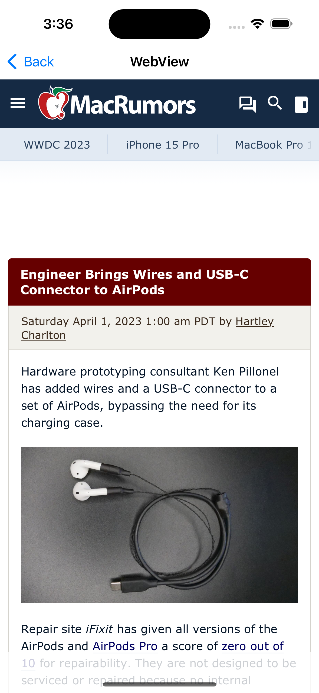
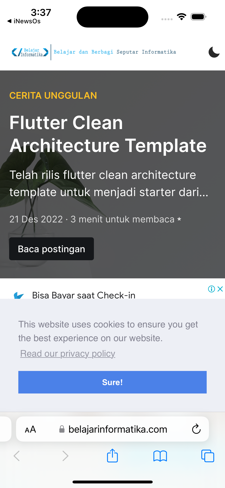

# iNewsOS

News Aggregator Apps Built with SwiftUI.

Tech Stack: SwiftUI, Combine, Alamofire, Swinject

Architecture: MVI Pattern, Clean Architecture

To use this project, change `MY_API_KEY` in `InjectionContainer.swift` with your api from [https://newsapi.org](https://newsapi.org)

## Home page

## Detail Page

## Webview Page

## About Page

## MyBlog page

